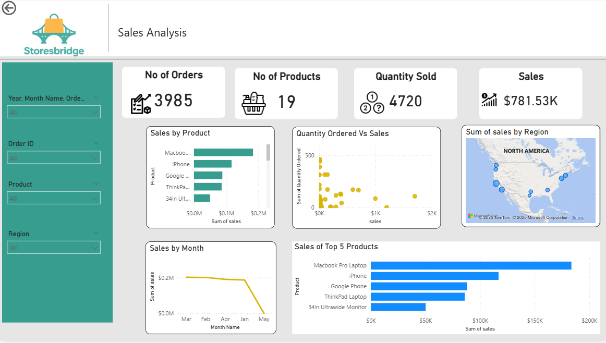

 E-Commerce Sales Dashboard – StoresBridge
 
This Power BI project visualizes and analyzes four months of sales data for **StoresBridge**, an e-commerce company. The goal was to develop a clear and interactive dashboard to help stakeholders monitor key sales metrics and make data-driven decisions.

 ## Project Overview

- **Company**: StoresBridge (E-commerce)
- **Data**: Online store sales data for 4 months
- **Tools**: Power BI Desktop + Power BI Service (with on-premises gateway)

##  Approach

1. **Analyzed the Business Requirements Document (BRD)**  
   Understood the company's analytical goals and KPIs.

2. **Data Preparation**  
   - Imported raw data into **Power Query Editor**  
   - Cleaned and transformed data for consistency and accuracy  

3. **Data Modeling**  
   - Created relationships between multiple tables  
   - Ensured a robust and scalable data model  

4. **DAX Measures and KPIs**  
   - Calculated key performance indicators (KPIs)  
   - Developed custom DAX measures for deep insights  

5. **Dashboard Development**  
   - Designed interactive charts, graphs, and performance breakdowns  
   - Used slicers and filters for dynamic exploration  
   - Focused on visual clarity and user experience  

6. **Deployment**  
   - Published the report to **Power BI Service**  
   - Set up a **data gateway** to connect on-premises data for automatic refreshes  

##  Dashboard Screenshot

